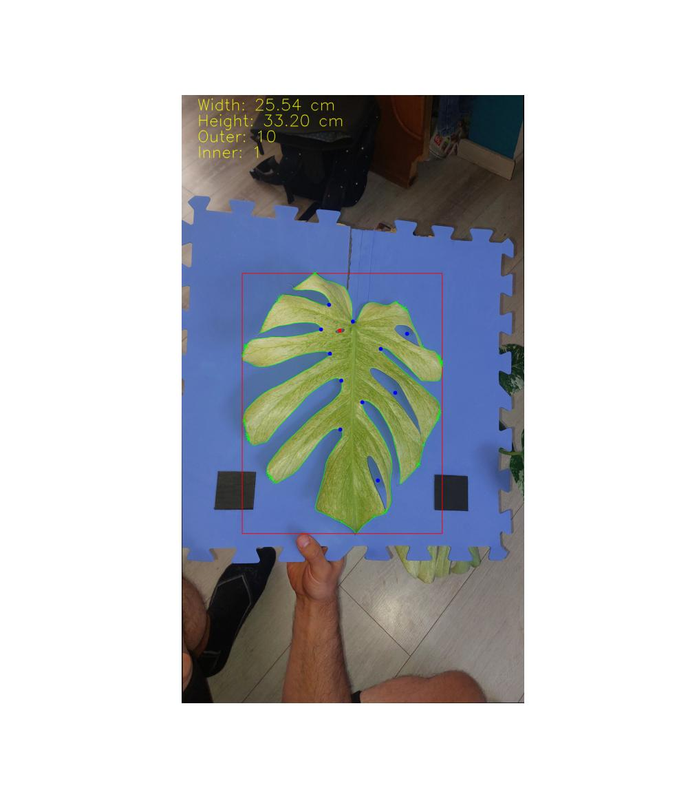

# Project Monstera: Leaf Analysis & Growth Prediction
Projekt zabývající se analýzou a predikcí růstu pokojových rostlin rodu **Monstera**. 
Využívám SQL databázi pro naměřené listy a rostliny, OpenCV k načtení listů z fotografie, Pandas k feature engineeringu a k vytvoření "Time-series Lags", SK-learn k analýze růstu a predikci. 

Budoucí rozšíření - predikce/zpětná analýza panašování (bíle (a další) spoty na listech různých variant - thai con, albo, yellow marilyn, etc)

## Architektura projektu
**Sběr dat:** Ruční měření kombinované s automatickým zpracováním obrazu. Ručně měřená data jsou uloženy do MySQL databáze (tabulky "plants" a "leaves"). Další sběr je proveden pomocí fotografií listů na modré podložce s referenčním čtvercem (5x5cm) a analýzy pomocí OpenCV. 
**Transformace:** Určená délka a šírka listu je doplněná o další pomocné hodnoty vhodné pro predikci. Vytvoření Time-series lag, klouzavých průměrů, růstových faktorů - matice pro trénovaný model.
**Predikční model:** Trénování "XGBRegressor" s multioutput. Model je trénován na predikci faktoru růstu a rozdílu fenestrace.

## Struktura repozitáře
* "get_size.py" – Jádro počítačového vidění. Třída "LeafAnalyzer" zajišťuje segmentaci obrazu, rotaci, kalibraci podle referenčního čtverce a detekci fenestrací.
* "load.py" – Skript pro připojení k MySQL databázi pomocí SQLAlchemy, stažení databázových tabulek a jejich export do CSV.
* "main_read_leaves.py" – Pipeline pro hromadné zpracování nových fotografií ze složky "pics" a integraci s původním datasetem.
* "preprocess.py" – Generování nových příznaků ("area_cm2", "days_since_acq"), tvorba lagových vlastností ("_lag(i)", "_rollmean", "_growth_rate") a transformace targetů.
* "prediction.py" – Sestavení predikčního řádku pro budoucí list a následná inverzní transformace predikovaných hodnot do reálných jednotek.
* "main.py" – Hlavní spouštěcí skript modelu. Provádí cross-validaci pomocí "LeaveOneGroupOut" (podle konkrétních rostlin), měří úspěšnost (RMSE) a trénuje finální model.

## OpenCV
Využívám modrou podložku s černým referenčním čtvercem o velikosti 5x5 cm na kterou umisťuji listy.
**Detekce podložky:** Konverze do HSV a prahování modré barvy ("cv2.inRange").
**Segmentace popředí:** Odstraněním modré masky z plochy podložky získáme izolovaný list a referenční čtverec.
**Kalibrace ("pixels_per_cm"):** Detekce černého čtverce (filtrace podle plochy a poměru stran). Výpočet pixelů na centimetr ze skloněného obdélníku ("cv2.minAreaRect").
**Narovnání obrazu:** Výpočet úhlu rotace čtverce a aplikace afinní transformace ("cv2.warpAffine") na masku popředí. Tím se list srovná vertikálně.
**Měření listu:** Nad narovnanou maskou listu je využit ohraničující obdelník (cv2.boundingRect) ve směru os. Délka a šířka listu je pak stanovana jeko velikosti hran tohoto obdelníku. 
**Analýza fenestrací:** 
    Vnitřní díry: Detekovány pomocí hierarchie kontur ("RETR_TREE"), kdy kontura má rodiče nastaveného na index listu a její plocha odpovídá limitům.
    Vnější díry: Detekovány pomocí analýzy konvexní obálky ("cv2.convexityDefects") + hierarchie kontur s větším limitem plochy.

Ukázka detekce listu pomocí OpenCV

## Feature Engineering & Machine Learning
Protože jsem měl problémy s regresí od stromových algoritmů (nepredikují větší hodnoty než viděly), přešel jsem k predikci faktoru růstu.
**Target features:**
**Rozměry (délka, šířka):** Model predikuje **faktor (ratio)** vůči předchozímu listu.
**Fenestrace (vnitřní, vnější):** Model predikuje **rozdíl (diff)** v počtu děr.

### Feature Engineering ("preprocess.py"):
Z historické sekvence listů každé rostliny (vyžadováno minimum "n_lags=3") se pro každý list počítají:
**Lagové hodnoty:** Vlastnosti listu $-1$, $-2$ a $-3$.
**Klouzavé statistiky:** Průměr, standardní odchylka a maximum z celé dosavadní historie rostliny.
**Rychlost růstu (Growth Rate):** Relativní změna přírůstku mezi předchozími listy.

### Machine learning
Finální model **XGBoost Regressor** (v MultiOutputRegressor pro současnou predikci všech 4 targetů).
**Nastavení:** 
Nižší počet stromů (n_estimator = 100) aby nedošlo k přetrénování na malém datasetu, 
Nižší hloubka (max_depth = 4),
Stabilizace v rychlosti učení (learning_rate = 0.05).

**Další testované modely:**
Lineární regrese: Selhávala, protože vztahy mezi listy jsou silně nelineární.
Random Forest: Docházelo k přetrénování a vykazoval horší výsledky na nových rostlinách.

### Validace modelu:
Proti leakingu dat využívám **LOGO (Leave-One-Group-Out)** -- jedna rostlina je vždy testovací. Výsledky jsou vyhodnoceny pomocí RMSE v cm po zpětné inverzi predikcí.

## 🛠️ Požadavky a Instalace
pip install numpy pandas xgboost scikit-learn opencv-python matplotlib sqlalchemy pymysql mysql-connector-python python-dotenv

Vytvořte lokální SQL databázi pomocí monstera.sql

Klonujte repozitář a vytvořte soubor "data.env" s přihlašovacími údaji k databázi:
   DB_USER=tvoje_jmeno
   DB_PASSWORD=tvoje_heslo
   DB_HOST=localhost
   DB_NAME=monstera_db
